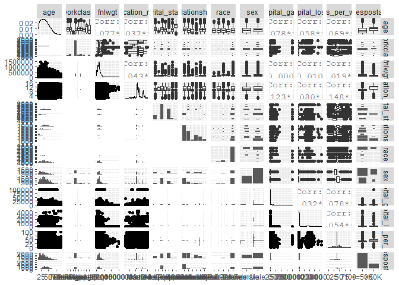
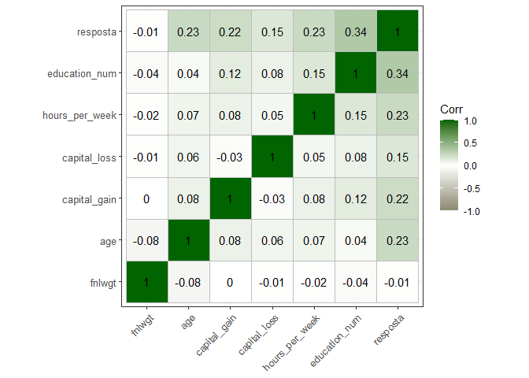
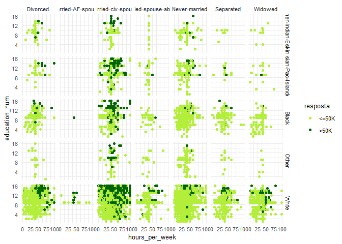
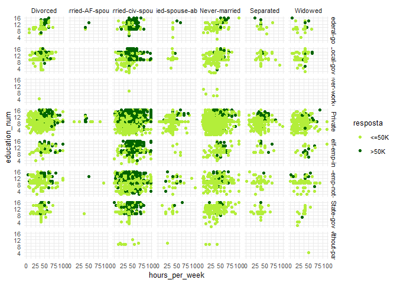
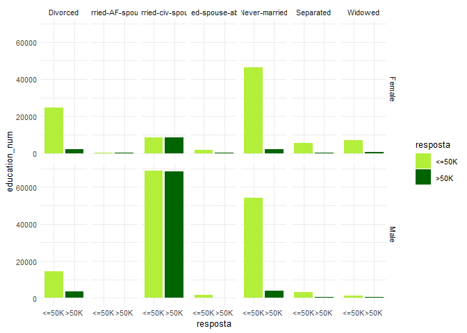
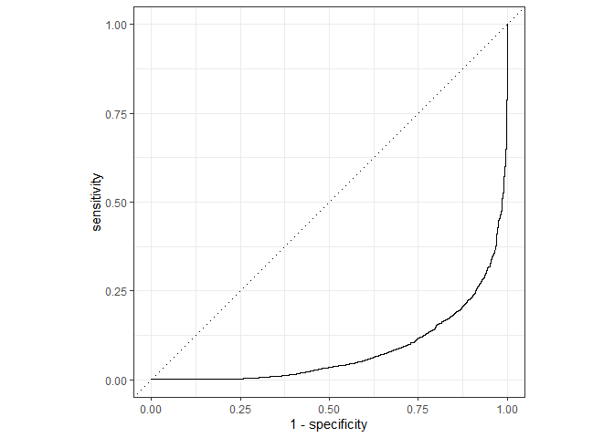
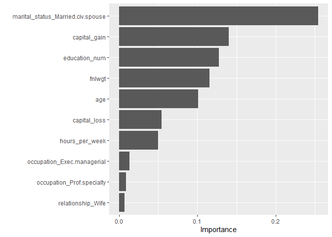

Curso-R - Intro ML Projeto Final
================
Érico Rocha
02/02/2021

  - [Configurando Ambiente](#configurando-ambiente)
      - [Pacotes](#pacotes)
  - [Introdução](#introdução)
      - [Objetivo](#objetivo)
  - [Análise Exploratória](#análise-exploratória)
      - [Exploração inicial do dataset](#exploração-inicial-do-dataset)
      - [Comparativo das variaveis com maior
        correlação](#comparativo-das-variaveis-com-maior-correlação)
  - [Processo de Modelagem](#processo-de-modelagem)
  - [Validação do Modelo](#validação-do-modelo)
  - [Conclusão](#conclusão)

# Configurando Ambiente

### Pacotes

``` r
library(tidymodels)
library(ISLR)
library(tidyverse)
library(modeldata)
library(pROC)
library(vip)
library(skimr)
library(naniar)
library(GGally)
library(ggcorrplot)
```

``` r
#Setando uma seed para deixar o processo reprodutível
set.seed(1)
```

# Introdução

Projeto final de Érico LE Rocha realizado no curso de Introdução ao
Machine Learning minstrado pela Curso-R que foi premiado com o terceiro
lugar entre os trabalhos da turma 2020-06.

O dataset utilizado para este exercício foi o de Renda de Adultos
(Income of Adults) disponível no site www.Kaggle.com. Esta base foi
extraída do Census de 1994. informações detalhadas sobre o dataset estão
disponíveis em <https://archive.ics.uci.edu/ml/datasets/adult>

### Objetivo

Criar um modelo preditivo capaz de determinar quais pessoas são capazes
de receber 50 mil dolareas anuais em renda. Para atingir o objetivo, a
seguir, iremos explorar a base para a posteriormente desenvolver um
modelo de classificação.

# Análise Exploratória

``` r
#Carregando o dataset (alterar para o caminho onde o dataset se encontra)
adults <- readr::read_rds("C:\\Users\\Erico\\Documents\\Erico\\Estudos\\Curso R\\Machine Learning\\Machine Learning\\Projeto Final\\adult.rds")
```

### Exploração inicial do dataset

``` r
# glimpse (visão rápida) da base de dados para verificar a estrutura do dataset.

glimpse(adults)
```

    ## Rows: 32,561
    ## Columns: 16
    ## $ age            <dbl> 39, 50, 38, 53, 28, 37, 49, 52, 31, 42, 37, 30, 23, ...
    ## $ workclass      <chr> "State-gov", "Self-emp-not-inc", "Private", "Private...
    ## $ fnlwgt         <dbl> 77516, 83311, 215646, 234721, 338409, 284582, 160187...
    ## $ education      <chr> "Bachelors", "Bachelors", "HS-grad", "11th", "Bachel...
    ## $ education_num  <dbl> 13, 13, 9, 7, 13, 14, 5, 9, 14, 13, 10, 13, 13, 12, ...
    ## $ marital_status <chr> "Never-married", "Married-civ-spouse", "Divorced", "...
    ## $ occupation     <chr> "Adm-clerical", "Exec-managerial", "Handlers-cleaner...
    ## $ relationship   <chr> "Not-in-family", "Husband", "Not-in-family", "Husban...
    ## $ race           <chr> "White", "White", "White", "Black", "Black", "White"...
    ## $ sex            <chr> "Male", "Male", "Male", "Male", "Female", "Female", ...
    ## $ capital_gain   <dbl> 2174, 0, 0, 0, 0, 0, 0, 0, 14084, 5178, 0, 0, 0, 0, ...
    ## $ capital_loss   <dbl> 0, 0, 0, 0, 0, 0, 0, 0, 0, 0, 0, 0, 0, 0, 0, 0, 0, 0...
    ## $ hours_per_week <dbl> 40, 13, 40, 40, 40, 40, 16, 45, 50, 40, 80, 40, 30, ...
    ## $ native_country <chr> "United-States", "United-States", "United-States", "...
    ## $ resposta       <chr> "<=50K", "<=50K", "<=50K", "<=50K", "<=50K", "<=50K"...
    ## $ id             <int> 1, 2, 3, 4, 5, 6, 7, 8, 9, 10, 11, 12, 13, 14, 15, 1...

Neste ponto podemos notar que temos variáveis do tipo numérica e do tipo
categórica.

``` r
# Skim para uma analise mais detalhada, explorando a distribuição de cada variável, NAs, entre outras informações relevantes para início da análise.
skim(adults)
```

|                                                  |        |
| :----------------------------------------------- | :----- |
| Name                                             | adults |
| Number of rows                                   | 32561  |
| Number of columns                                | 16     |
| \_\_\_\_\_\_\_\_\_\_\_\_\_\_\_\_\_\_\_\_\_\_\_   |        |
| Column type frequency:                           |        |
| character                                        | 9      |
| numeric                                          | 7      |
| \_\_\_\_\_\_\_\_\_\_\_\_\_\_\_\_\_\_\_\_\_\_\_\_ |        |
| Group variables                                  | None   |

Data summary

**Variable type: character**

| skim\_variable  | n\_missing | complete\_rate | min | max | empty | n\_unique | whitespace |
| :-------------- | ---------: | -------------: | --: | --: | ----: | --------: | ---------: |
| workclass       |       1836 |           0.94 |   7 |  16 |     0 |         8 |          0 |
| education       |          0 |           1.00 |   3 |  12 |     0 |        16 |          0 |
| marital\_status |          0 |           1.00 |   7 |  21 |     0 |         7 |          0 |
| occupation      |       1843 |           0.94 |   5 |  17 |     0 |        14 |          0 |
| relationship    |          0 |           1.00 |   4 |  14 |     0 |         6 |          0 |
| race            |          0 |           1.00 |   5 |  18 |     0 |         5 |          0 |
| sex             |          0 |           1.00 |   4 |   6 |     0 |         2 |          0 |
| native\_country |        583 |           0.98 |   4 |  26 |     0 |        41 |          0 |
| resposta        |          0 |           1.00 |   4 |   5 |     0 |         2 |          0 |

**Variable type: numeric**

| skim\_variable   | n\_missing | complete\_rate |      mean |        sd |    p0 |    p25 |    p50 |    p75 |    p100 | hist  |
| :--------------- | ---------: | -------------: | --------: | --------: | ----: | -----: | -----: | -----: | ------: | :---- |
| age              |          0 |              1 |     38.58 |     13.64 |    17 |     28 |     37 |     48 |      90 | ▇▇▅▂▁ |
| fnlwgt           |          0 |              1 | 189778.37 | 105549.98 | 12285 | 117827 | 178356 | 237051 | 1484705 | ▇▁▁▁▁ |
| education\_num   |          0 |              1 |     10.08 |      2.57 |     1 |      9 |     10 |     12 |      16 | ▁▁▇▃▁ |
| capital\_gain    |          0 |              1 |   1077.65 |   7385.29 |     0 |      0 |      0 |      0 |   99999 | ▇▁▁▁▁ |
| capital\_loss    |          0 |              1 |     87.30 |    402.96 |     0 |      0 |      0 |      0 |    4356 | ▇▁▁▁▁ |
| hours\_per\_week |          0 |              1 |     40.44 |     12.35 |     1 |     40 |     40 |     45 |      99 | ▁▇▃▁▁ |
| id               |          0 |              1 |  16281.00 |   9399.70 |     1 |   8141 |  16281 |  24421 |   32561 | ▇▇▇▇▇ |

Utilizando o comando skim do pacote “skimr” podemos analisar com mais
detalhe nosso dataset. Podemos verificar os missing values por variável,
valores mínimos e máximos, os quartis e mediana, além da média, desvio
padrão, valores únicos e a separação das variáveis categóricas e
numéricas.

Para seguir com a análise, vamos gerar um gráfico que demonstra a
interação entre as variáveis, utilizando a função ggpairs do pacote
GGally.

``` r
#Visualização da interação entre as variáveis
GGally::ggpairs(adults %>% select(-id,-occupation,-native_country,-education))
```

<!-- -->

verificando o gráfico de interação entre as variáveis, podemos observar
que algumas variáveis estão em ordem de grandeza diferentes e que
possivelmente necessitaremos normalizar o dataset no processo de
modelagem. Também conseguimos ter uma primeira ideia de como as
variaveis se relacionam e como se influenciam entre si indicando
possíveis candidatas para serem utilizadas no nosso modelo preditivo.

Aprofundando um pouco mais a análise, geramos um correlograma, que
demonstra a correlação entre as variáveis numéricas de nosso dataset.
Para a criação deste gráfico utilizamos o pacote ggcorrplot.

``` r
#Visualização da correlação entre variáveis
adults %>% 
  mutate(
    resposta = ifelse(resposta == "<=50K", 0, 1)
  ) %>% 
  select_if(is.numeric) %>%
  select(-id) %>% 
  cor(.) %>% 
  ggcorrplot(hc.order = TRUE, 
             lab = TRUE, 
             lab_size = 4,
             tl.cex = 10,
             method="square", 
             colors = c("lemonchiffon4", "white", "darkgreen"),
             ggtheme=theme_bw, insig = "blank")
```

<!-- -->

Neste gráfico notamos que algumas variáveis tem uma correlação mais alta
com a variável resposta, como por exemplo education\_num que é o nível
de educação de cada registro da base e também a idade.

Após identificar as variávies que tiveram uma correlação mais
interessante com a variável resposta, podemos estender um pouco mais a
análise e verificar como os registros estão distribuidos dentro de
alguns cenários.

Para este ponto da análise exploratória iremos utilizar ggplot criando
paineis organizados por algumas variávies através da função facet\_wrap.
Isso permite uma analise visual das distribuições das variáveis
selecionadas.

### Comparativo das variaveis com maior correlação

``` r
# Education num vs hours per week vs race vs marital_status vs resposta (50k+ / 50k-)
adults %>% 
  ggplot(aes(x = hours_per_week, y = education_num)) +
  geom_point(aes(color = resposta)) +
  facet_grid(race ~ marital_status) +
  scale_color_manual(values = c("olivedrab2", "darkgreen")) + 
  theme_minimal(10)
```

<!-- -->

``` r
# Education num vs hours per week vs workclass vs marital_status vs resposta (50k+ / 50k-)
adults %>% 
  filter(!is.na(workclass)) %>% 
  ggplot(aes(x = hours_per_week, y = education_num)) +
  geom_point(aes(color = resposta)) +
  facet_grid(workclass ~ marital_status) +
  scale_color_manual(values = c("olivedrab2", "darkgreen")) + 
  theme_minimal(10)
```

<!-- -->

``` r
# Education num vs sex vs marital_status vs resposta (50k+ / 50k-)
adults %>% 
  ggplot(aes(x = resposta, y = education_num)) +
  geom_col(aes(fill = resposta)) +
  facet_grid(sex ~ marital_status) +
  scale_fill_manual(values = c("olivedrab2", "darkgreen")) + 
  theme_minimal(10)
```

<!-- -->

Com as análises realizadas acima conseguimos ter alguns insights que nos
ajudam a escolher os melhores steps no momento da criação da nossa
receita. Verificando a presença de NA nos campos de workclass,
occupation e native\_county e observando a distribuição das categorias,
entendo que a melhor alternativa seria realizar imputção, utilizando a
moda.

Analisando de forma geral a correlação entre as variáveis numéricas,
entendo que existe uma importancia entre grau de instrução, capital gain
e horas por semana, em relação a nossa variável resposta.

As variáveis numericas, estão em gradezas diferentes e por conta disso
podemos utilizar a normalização.

Ao explorar mais detalhadamente, podemos notar que em alguns setores
como o privado, o grau de instrução é extremamente determinante para
dizer se haverá ganho anual acima de 50K. Para autonomos esta regra não
ocorre da mesma maneira.

Podemos inferir que a raça e o estado civil são imporantes na predição
do valor anual, pois pessoas casadas tem maior incidencia valores acima
de 50K/ano. Ao contrario dos casados, quem é separado ou nunca casou tem
uma maior incidencia de valores abaixo de 50K.

Se compararmos os sexo, o comportamento de ambos os sexos é parecido em
relação ao ganho, estado civil e grau de instrução.

Em relação a raça, vemos claramente uma disparidade em relação aos
ganhos em pessoas brancas e as demais raças. Quando isso é cruzado com
estado civil e grau de instrução, a disparidade fica ainda mais
transparente. Pessoas negras, viuvas ou separadas e pessoas
amerindias/eskimo tem baixissima ou nenhuma incidencia de valores acima
de 50K neste dataset.

# Processo de Modelagem

``` r
#Início do processo de modelagem

#Split inicial de treino e teste
adults_initial_split <- adults %>% initial_split(3/4)
adults_train <- training(adults_initial_split)
adults_test <- testing(adults_initial_split)
```

A primeira coisa no processo de modelagem foi realizar o split da base
de dados e separar em treino e teste, para fazer a validação após a
criação do modelo, tunagem e treino do modelo.

Abaixo iremos criar as receitas (recipes) com todas as tranformações
necessárias para nosso modelo performar de uma maneira satisfatória.
Este processo foi realizado algumas vezes até chegar no ponto em que
está. A medida que incluimos steps na receita, vamos validando e
verificando os impactos.

Utilizaremos o pacote tidymodels

``` r
#criação da Receita com as transformações necessárias
adults_recipe <- recipe(resposta ~ ., data = adults_train) %>%
  #remove valores com zero variancia
  step_zv(all_predictors()) %>%
  #remove coluna de Id, que não será utilizda na modelagem
  step_rm(id) %>%
  #inclui os não identificados para as variáveis categóricas
  step_unknown(all_nominal(), -all_outcomes()) %>% 
  #realiza imputação da moda nas variáveis categoricas que tem NA - acho que o de cima (unknow) anula essa mas deixei no codigo.
  step_modeimpute(all_nominal(), -all_outcomes()) %>%
  #realiza imputação da mediana nas variáveis numéricas que tem NA
  step_medianimpute(all_numeric()) %>%
  #realiza a normalização das variáveis númericas
  step_normalize(all_numeric()) %>% 
  #prepara base para receber novas variavéis não identificadas
  step_novel(all_nominal(), -all_outcomes()) %>%
  #Faz a dumificação das variáveis categóricas para o modelo processar
  step_dummy(all_nominal(), -all_outcomes())
```

Esta é a etapa do script em que verificamos a receita e identificamos se
existe a necessidade de incluir ou retirar algum step.

``` r
#Glimpse do juice da receita: verifica como ficou a receitinha pronta! 
#Você não irá perceber mas eu mudei isso 500 vezes até chegar aqui!
glimpse(juice(prep(adults_recipe)))
```

    ## Rows: 24,421
    ## Columns: 114
    ## $ age                                       <dbl> 0.02968992, 0.83457776, 1...
    ## $ fnlwgt                                    <dbl> -1.06792944, -1.01247332,...
    ## $ education_num                             <dbl> 1.13943848, 1.13943848, -...
    ## $ capital_gain                              <dbl> 0.1467381, -0.1458944, -0...
    ## $ capital_loss                              <dbl> -0.2170139, -0.2170139, -...
    ## $ hours_per_week                            <dbl> -0.03582408, -2.22500051,...
    ## $ resposta                                  <fct> <=50K, <=50K, <=50K, <=50...
    ## $ workclass_Local.gov                       <dbl> 0, 0, 0, 0, 0, 0, 0, 0, 0...
    ## $ workclass_Never.worked                    <dbl> 0, 0, 0, 0, 0, 0, 0, 0, 0...
    ## $ workclass_Private                         <dbl> 0, 0, 1, 1, 1, 1, 1, 1, 0...
    ## $ workclass_Self.emp.inc                    <dbl> 0, 0, 0, 0, 0, 0, 0, 0, 0...
    ## $ workclass_Self.emp.not.inc                <dbl> 0, 1, 0, 0, 0, 0, 0, 0, 0...
    ## $ workclass_State.gov                       <dbl> 1, 0, 0, 0, 0, 0, 0, 0, 1...
    ## $ workclass_Without.pay                     <dbl> 0, 0, 0, 0, 0, 0, 0, 0, 0...
    ## $ workclass_unknown                         <dbl> 0, 0, 0, 0, 0, 0, 0, 0, 0...
    ## $ workclass_new                             <dbl> 0, 0, 0, 0, 0, 0, 0, 0, 0...
    ## $ education_X11th                           <dbl> 0, 0, 1, 0, 0, 0, 0, 0, 0...
    ## $ education_X12th                           <dbl> 0, 0, 0, 0, 0, 0, 0, 0, 0...
    ## $ education_X1st.4th                        <dbl> 0, 0, 0, 0, 0, 0, 0, 0, 0...
    ## $ education_X5th.6th                        <dbl> 0, 0, 0, 0, 0, 0, 0, 0, 0...
    ## $ education_X7th.8th                        <dbl> 0, 0, 0, 0, 0, 0, 0, 0, 0...
    ## $ education_X9th                            <dbl> 0, 0, 0, 0, 0, 0, 0, 0, 0...
    ## $ education_Assoc.acdm                      <dbl> 0, 0, 0, 0, 0, 0, 0, 0, 0...
    ## $ education_Assoc.voc                       <dbl> 0, 0, 0, 0, 0, 0, 0, 0, 0...
    ## $ education_Bachelors                       <dbl> 1, 1, 0, 1, 0, 0, 1, 0, 1...
    ## $ education_Doctorate                       <dbl> 0, 0, 0, 0, 0, 0, 0, 0, 0...
    ## $ education_HS.grad                         <dbl> 0, 0, 0, 0, 0, 0, 0, 0, 0...
    ## $ education_Masters                         <dbl> 0, 0, 0, 0, 1, 1, 0, 0, 0...
    ## $ education_Preschool                       <dbl> 0, 0, 0, 0, 0, 0, 0, 0, 0...
    ## $ education_Prof.school                     <dbl> 0, 0, 0, 0, 0, 0, 0, 0, 0...
    ## $ education_Some.college                    <dbl> 0, 0, 0, 0, 0, 0, 0, 1, 0...
    ## $ education_unknown                         <dbl> 0, 0, 0, 0, 0, 0, 0, 0, 0...
    ## $ education_new                             <dbl> 0, 0, 0, 0, 0, 0, 0, 0, 0...
    ## $ marital_status_Married.AF.spouse          <dbl> 0, 0, 0, 0, 0, 0, 0, 0, 0...
    ## $ marital_status_Married.civ.spouse         <dbl> 0, 1, 1, 1, 1, 0, 1, 1, 1...
    ## $ marital_status_Married.spouse.absent      <dbl> 0, 0, 0, 0, 0, 0, 0, 0, 0...
    ## $ marital_status_Never.married              <dbl> 1, 0, 0, 0, 0, 1, 0, 0, 0...
    ## $ marital_status_Separated                  <dbl> 0, 0, 0, 0, 0, 0, 0, 0, 0...
    ## $ marital_status_Widowed                    <dbl> 0, 0, 0, 0, 0, 0, 0, 0, 0...
    ## $ marital_status_unknown                    <dbl> 0, 0, 0, 0, 0, 0, 0, 0, 0...
    ## $ marital_status_new                        <dbl> 0, 0, 0, 0, 0, 0, 0, 0, 0...
    ## $ occupation_Armed.Forces                   <dbl> 0, 0, 0, 0, 0, 0, 0, 0, 0...
    ## $ occupation_Craft.repair                   <dbl> 0, 0, 0, 0, 0, 0, 0, 0, 0...
    ## $ occupation_Exec.managerial                <dbl> 0, 1, 0, 0, 1, 0, 1, 1, 0...
    ## $ occupation_Farming.fishing                <dbl> 0, 0, 0, 0, 0, 0, 0, 0, 0...
    ## $ occupation_Handlers.cleaners              <dbl> 0, 0, 1, 0, 0, 0, 0, 0, 0...
    ## $ occupation_Machine.op.inspct              <dbl> 0, 0, 0, 0, 0, 0, 0, 0, 0...
    ## $ occupation_Other.service                  <dbl> 0, 0, 0, 0, 0, 0, 0, 0, 0...
    ## $ occupation_Priv.house.serv                <dbl> 0, 0, 0, 0, 0, 0, 0, 0, 0...
    ## $ occupation_Prof.specialty                 <dbl> 0, 0, 0, 1, 0, 1, 0, 0, 1...
    ## $ occupation_Protective.serv                <dbl> 0, 0, 0, 0, 0, 0, 0, 0, 0...
    ## $ occupation_Sales                          <dbl> 0, 0, 0, 0, 0, 0, 0, 0, 0...
    ## $ occupation_Tech.support                   <dbl> 0, 0, 0, 0, 0, 0, 0, 0, 0...
    ## $ occupation_Transport.moving               <dbl> 0, 0, 0, 0, 0, 0, 0, 0, 0...
    ## $ occupation_unknown                        <dbl> 0, 0, 0, 0, 0, 0, 0, 0, 0...
    ## $ occupation_new                            <dbl> 0, 0, 0, 0, 0, 0, 0, 0, 0...
    ## $ relationship_Not.in.family                <dbl> 1, 0, 0, 0, 0, 1, 0, 0, 0...
    ## $ relationship_Other.relative               <dbl> 0, 0, 0, 0, 0, 0, 0, 0, 0...
    ## $ relationship_Own.child                    <dbl> 0, 0, 0, 0, 0, 0, 0, 0, 0...
    ## $ relationship_Unmarried                    <dbl> 0, 0, 0, 0, 0, 0, 0, 0, 0...
    ## $ relationship_Wife                         <dbl> 0, 0, 0, 1, 1, 0, 0, 0, 0...
    ## $ relationship_unknown                      <dbl> 0, 0, 0, 0, 0, 0, 0, 0, 0...
    ## $ relationship_new                          <dbl> 0, 0, 0, 0, 0, 0, 0, 0, 0...
    ## $ race_Asian.Pac.Islander                   <dbl> 0, 0, 0, 0, 0, 0, 0, 0, 1...
    ## $ race_Black                                <dbl> 0, 0, 1, 1, 0, 0, 0, 1, 0...
    ## $ race_Other                                <dbl> 0, 0, 0, 0, 0, 0, 0, 0, 0...
    ## $ race_White                                <dbl> 1, 1, 0, 0, 1, 1, 1, 0, 0...
    ## $ race_unknown                              <dbl> 0, 0, 0, 0, 0, 0, 0, 0, 0...
    ## $ race_new                                  <dbl> 0, 0, 0, 0, 0, 0, 0, 0, 0...
    ## $ sex_Male                                  <dbl> 1, 1, 1, 0, 0, 0, 1, 1, 1...
    ## $ sex_unknown                               <dbl> 0, 0, 0, 0, 0, 0, 0, 0, 0...
    ## $ sex_new                                   <dbl> 0, 0, 0, 0, 0, 0, 0, 0, 0...
    ## $ native_country_Canada                     <dbl> 0, 0, 0, 0, 0, 0, 0, 0, 0...
    ## $ native_country_China                      <dbl> 0, 0, 0, 0, 0, 0, 0, 0, 0...
    ## $ native_country_Columbia                   <dbl> 0, 0, 0, 0, 0, 0, 0, 0, 0...
    ## $ native_country_Cuba                       <dbl> 0, 0, 0, 1, 0, 0, 0, 0, 0...
    ## $ native_country_Dominican.Republic         <dbl> 0, 0, 0, 0, 0, 0, 0, 0, 0...
    ## $ native_country_Ecuador                    <dbl> 0, 0, 0, 0, 0, 0, 0, 0, 0...
    ## $ native_country_El.Salvador                <dbl> 0, 0, 0, 0, 0, 0, 0, 0, 0...
    ## $ native_country_England                    <dbl> 0, 0, 0, 0, 0, 0, 0, 0, 0...
    ## $ native_country_France                     <dbl> 0, 0, 0, 0, 0, 0, 0, 0, 0...
    ## $ native_country_Germany                    <dbl> 0, 0, 0, 0, 0, 0, 0, 0, 0...
    ## $ native_country_Greece                     <dbl> 0, 0, 0, 0, 0, 0, 0, 0, 0...
    ## $ native_country_Guatemala                  <dbl> 0, 0, 0, 0, 0, 0, 0, 0, 0...
    ## $ native_country_Haiti                      <dbl> 0, 0, 0, 0, 0, 0, 0, 0, 0...
    ## $ native_country_Holand.Netherlands         <dbl> 0, 0, 0, 0, 0, 0, 0, 0, 0...
    ## $ native_country_Honduras                   <dbl> 0, 0, 0, 0, 0, 0, 0, 0, 0...
    ## $ native_country_Hong                       <dbl> 0, 0, 0, 0, 0, 0, 0, 0, 0...
    ## $ native_country_Hungary                    <dbl> 0, 0, 0, 0, 0, 0, 0, 0, 0...
    ## $ native_country_India                      <dbl> 0, 0, 0, 0, 0, 0, 0, 0, 1...
    ## $ native_country_Iran                       <dbl> 0, 0, 0, 0, 0, 0, 0, 0, 0...
    ## $ native_country_Ireland                    <dbl> 0, 0, 0, 0, 0, 0, 0, 0, 0...
    ## $ native_country_Italy                      <dbl> 0, 0, 0, 0, 0, 0, 0, 0, 0...
    ## $ native_country_Jamaica                    <dbl> 0, 0, 0, 0, 0, 0, 0, 0, 0...
    ## $ native_country_Japan                      <dbl> 0, 0, 0, 0, 0, 0, 0, 0, 0...
    ## $ native_country_Laos                       <dbl> 0, 0, 0, 0, 0, 0, 0, 0, 0...
    ## $ native_country_Mexico                     <dbl> 0, 0, 0, 0, 0, 0, 0, 0, 0...
    ## $ native_country_Nicaragua                  <dbl> 0, 0, 0, 0, 0, 0, 0, 0, 0...
    ## $ native_country_Outlying.US.Guam.USVI.etc. <dbl> 0, 0, 0, 0, 0, 0, 0, 0, 0...
    ## $ native_country_Peru                       <dbl> 0, 0, 0, 0, 0, 0, 0, 0, 0...
    ## $ native_country_Philippines                <dbl> 0, 0, 0, 0, 0, 0, 0, 0, 0...
    ## $ native_country_Poland                     <dbl> 0, 0, 0, 0, 0, 0, 0, 0, 0...
    ## $ native_country_Portugal                   <dbl> 0, 0, 0, 0, 0, 0, 0, 0, 0...
    ## $ native_country_Puerto.Rico                <dbl> 0, 0, 0, 0, 0, 0, 0, 0, 0...
    ## $ native_country_Scotland                   <dbl> 0, 0, 0, 0, 0, 0, 0, 0, 0...
    ## $ native_country_South                      <dbl> 0, 0, 0, 0, 0, 0, 0, 0, 0...
    ## $ native_country_Taiwan                     <dbl> 0, 0, 0, 0, 0, 0, 0, 0, 0...
    ## $ native_country_Thailand                   <dbl> 0, 0, 0, 0, 0, 0, 0, 0, 0...
    ## $ native_country_Trinadad.Tobago            <dbl> 0, 0, 0, 0, 0, 0, 0, 0, 0...
    ## $ native_country_United.States              <dbl> 1, 1, 1, 0, 1, 1, 1, 1, 0...
    ## $ native_country_Vietnam                    <dbl> 0, 0, 0, 0, 0, 0, 0, 0, 0...
    ## $ native_country_Yugoslavia                 <dbl> 0, 0, 0, 0, 0, 0, 0, 0, 0...
    ## $ native_country_unknown                    <dbl> 0, 0, 0, 0, 0, 0, 0, 0, 0...
    ## $ native_country_new                        <dbl> 0, 0, 0, 0, 0, 0, 0, 0, 0...

Aqui iremos slecionar a tunagem do modelo. Para tal, escolhemos os
hiperparametros que serão tunados pelo tunegrid (funçaõ do pacote
tidymodels) e podemos definir manualmente também, como por exemplo o
hiperparametro trees que foi definido como 250.

O modelo escolhido para este projeto foi o xgboost, que apesar de sua
complexidade no momento da explicação dos resultados, por ser um modelo
muito robusto demonstra uma alta capacidade de predição.

``` r
#tunando o modelo!!! Ta chegando a hora!
#modelo escolhido foi o xgboost.
adults_lr_model <- boost_tree(
  mode = "classification", 
  min_n = tune(),
  mtry = tune(),
  #Pesquisando intensamente na internet, encontrei esse valor mágico de 250 trees! 
  #Paciência na hora de rodar!
  trees = 250,
  tree_depth = tune(),
  learn_rate = tune(),
  loss_reduction = tune(),
  sample_size = tune()
) %>%
  set_engine("xgboost", lambda = 0, params = list(min_child_weight = 0))
```

Neste momento criamos o workflow, processo em que unimos a receita com
os steps de transformação escolhidas com o modelo selecionado. Também
definimos um processo de crossvalidation com 10 folds.

``` r
#Cria o workflow com o modelo + a receita.
adults_workflow <- workflow() %>%
  add_model(adults_lr_model) %>%
  add_recipe(adults_recipe)

#cria as folds do processo de cross validation. Sim, coloquei 10 no K! Paciência parte 2!!
adults_resamples <- vfold_cv(adults_train, v = 10)
```

Após toda a definição das etapas este é o momento em que rodamos o
modelo com tudo que foi especificados anteriormente. A métrica de
validação neste caso é a área sob a curva ROC (roc\_auc).

Assim que todos os modelos gerados terminam de rodar, selecionamos o
melhor modelo de acordo com nossa métrica e finalizamos o workflow.

``` r
#Aqui que a magica acontece. Por Favor, de o play vá tomar um bom café pq demora!! rss
adults_tune_grid <- tune_grid(
  adults_workflow,
  resamples = adults_resamples,
  metrics = metric_set(roc_auc)
)

#Seleciona o melhor modelo da cacetada de modelos que geramos acima.
adults_select_best <- select_best(adults_tune_grid, "roc_auc")
adults_workflow <- adults_workflow %>% finalize_workflow(adults_select_best)
```

Para testar se o modelo está indo bem fizemo também uma validação com
toda a base de dados, coletamos as métricas, e as predições para plotar
o gráfico da curva ROC. Outro ponto interessante é a verificação da
importancia de cada variável no modelo. Para isso utilizamos a função
vip do pacote vip.

``` r
#Faz o teste com todo mundo para saber se valeu a pena toda a espera.
adults_last_fit <- last_fit(
  adults_workflow,
  adults_initial_split
)

#Ve as métricas, que aparentemente ficaram boas.
collect_metrics(adults_last_fit)
```

    ## # A tibble: 2 x 3
    ##   .metric  .estimator .estimate
    ##   <chr>    <chr>          <dbl>
    ## 1 accuracy binary         0.862
    ## 2 roc_auc  binary         0.918

``` r
#plot da Area sob a curva ROC.
collect_predictions(adults_last_fit) %>% 
  roc_curve(resposta, '.pred_>50K') %>% 
  autoplot()
```

<!-- -->

``` r
#Verificando a importancia das variáveis.
vip(extract_model(adults_last_fit$.workflow[[1]]))
```

<!-- -->

``` r
vi(extract_model(adults_last_fit$.workflow[[1]]))
```

    ## # A tibble: 94 x 2
    ##    Variable                          Importance
    ##    <chr>                                  <dbl>
    ##  1 marital_status_Married.civ.spouse    0.255  
    ##  2 capital_gain                         0.140  
    ##  3 education_num                        0.127  
    ##  4 fnlwgt                               0.116  
    ##  5 age                                  0.101  
    ##  6 capital_loss                         0.0540 
    ##  7 hours_per_week                       0.0500 
    ##  8 occupation_Exec.managerial           0.0130 
    ##  9 occupation_Prof.specialty            0.00848
    ## 10 relationship_Wife                    0.00706
    ## # ... with 84 more rows

# Validação do Modelo

O modelo foi criado, tunado, treinado e verificado. Após estas etapas,
que dependem de muito ajuste fino durante o desenvolvimento, vamos
validar nosso modelo com a base de test criada no split inicial da base.

Como este projeto também era uma competição, geramos um arquivo final em
csv para subir no site do kaggle.

``` r
#Chegou a hora de validar com os dados fresquinhos e desconhecidos que chegaram.
adults_lr_fit <- fit(adults_workflow, data = adults)

predict(adults_lr_fit, new_data = adults_test, type = "prob")
```

    ## # A tibble: 8,140 x 2
    ##    `.pred_<=50K` `.pred_>50K`
    ##            <dbl>        <dbl>
    ##  1         0.976      0.0242 
    ##  2         0.995      0.00459
    ##  3         0.667      0.333  
    ##  4         0.882      0.118  
    ##  5         0.635      0.365  
    ##  6         0.985      0.0148 
    ##  7         0.831      0.169  
    ##  8         0.874      0.126  
    ##  9         0.984      0.0159 
    ## 10         0.426      0.574  
    ## # ... with 8,130 more rows

``` r
adult_val <- read_rds("C:\\Users\\Erico\\Documents\\Erico\\Estudos\\Curso R\\Machine Learning\\Machine Learning\\Projeto Final\\adult_val.rds")

adult_val_sumbissao <- adult_val %>%
  mutate(
    more_than_50k = predict(adults_lr_fit, new_data = adult_val, type = "prob")$'.pred_>50K'
  ) %>%
  select(id, more_than_50k)

head(adult_val_sumbissao)
```

    ## # A tibble: 6 x 2
    ##      id more_than_50k
    ##   <int>         <dbl>
    ## 1 32562      0.00344 
    ## 2 32563      0.169   
    ## 3 32564      0.418   
    ## 4 32565      0.997   
    ## 5 32566      0.000364
    ## 6 32567      0.00754

``` r
write_csv(adult_val_sumbissao, "adult_val_sumbissao_er.csv")
```

# Conclusão

Com o desenvolvimento deste projeto final foi possível notar que a
análise exploratória bem detalhada nos porpocionou um melhor
direcionamento nas transformações necessárias no dataset, no
desenvolvimento do modelo e também no momento e explicar os resultados
obtidos.
